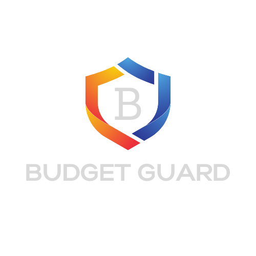

<!-- PROJECT LOGO -->
 

  

<h3 align="center">Budget Guard</h3>

  

  <a href="https://github.com/austinchen27">Austin Chen</a> and I has made a budgeting app because we feel like it has never been done right. We are giving the user more freedom with theyre budgeting like in exel. But also giving them an experince of a well developed app. We want the user to have as much freedom over sorting theyre budgets for the year and be able to acess old data at any time. We plan on expanding on this project, it is very scalable.
  

<!-- ABOUT THE PROJECT -->
## Built With

* JavaScript
* React
* MongoDB
* Express
* Material UI
* Bootstrap

(<a href="#top">back to top</a>)

<!-- USAGE EXAMPLES -->
## Future Updates

* Allow users to delete boards that they do not want anymore
* Implimant Sass instead of Material UI and Bootstrap
* Make the front end of the dashboard more visually pleasing for the user
* Impliment Plaid api so the user has an option to link theyre bank account for accessable information

(<a href="#top">back to top</a>)

